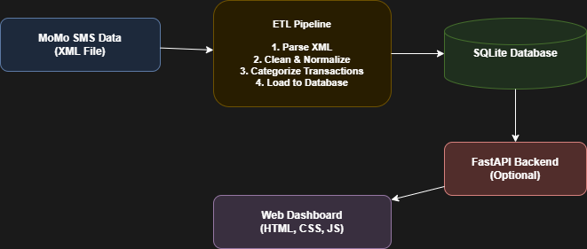

# Team 4 – MoMo Data Project
Momo SMS data processing in XML format

## Project Description
A fullstack application that processes MTN MoMo SMS data in XML format,
cleans and categorizes the transactions, stores them in a MySQL database,
and displays them on a frontend dashboard.

## Team Members
- Moreen Muthoni Murugi - m.murugi@alustudent.com
- Emna Barezi - e.barezi@alustudent.com

## Project Structure
- `data/` — raw XML data and processed outputs
- `etl/` — Python scripts for parsing, cleaning and loading data
- `web/` — frontend dashboard files
- `api/` — optional FastAPI backend
- `scripts/` — shell scripts to run the ETL pipeline
- `tests/` — unit tests
- `docs/` — documentation and diagrams
- `examples/` — JSON schema examples
- `database/` — SQL database setup scripts

## Architecture Diagram

## Database Design
The database has 5 tables:

Transactions: stores all MoMo transaction records
Users: stores sender and receiver information
Transaction_Categories: stores transaction types
System_Logs: tracks data processing events
Transaction_User_Links: links transactions to users (Many to Many)

## Scrum Board
[View our Scrum Board here](https://github.com/users/EmnaBarezi/projects/1/views/1)

## AI Usage
See `docs/ai_usage_log.md` for details on AI tool usage.

This is the link to our ERD DIAGRAM : https://drive.google.com/file/d/1ZNdQhfY_PDDCywt5a5F49js5UMI65qfJ/view?usp=sharing

The ERD dagram is also present in the docs file as a pdf named MoMo_ERD.drawio.pdf

## REST API (ASSIGNMENT 3)

This assignment adds a secured REST API on top of the existing MoMo data project.

This project processes Mobile Money (MoMo) SMS transaction data from an XML dataset and exposes the records through a secured REST API built using Python.

The API supports CRUD operations (Create, Read, Update, Delete), Basic Authentication, and includes a comparison of search algorithms as part of the Data Structures and Algorithms (DSA) component.

### Requirements

- Python 3.x (no extra libraries needed, uses built-in modules only)

### How to Run the API Server

1. Clone the repository:
   git clone https://github.com/Moreenmm/Team4-Momo-data-project.git

2. Navigate to the project folder:
   cd Team4-Momo-data-project

3. Run the API server:
   python api/app.py

4. The server will start at http://localhost:8000

### How to Test the API

Use curl or PowerShell to test the endpoints.

Get all transactions:
curl.exe -u admin:password123 http://localhost:8000/transactions

Get one transaction:
curl.exe -u admin:password123 http://localhost:8000/transactions/1

Test wrong credentials:
curl.exe -u wrong:wrong http://localhost:8000/transactions

### How to Run the DSA Comparison
python dsa/search.py

### API Credentials

Username: admin
Password: password123

### Screenshots

All test screenshots are in the screenshots/ folder.
